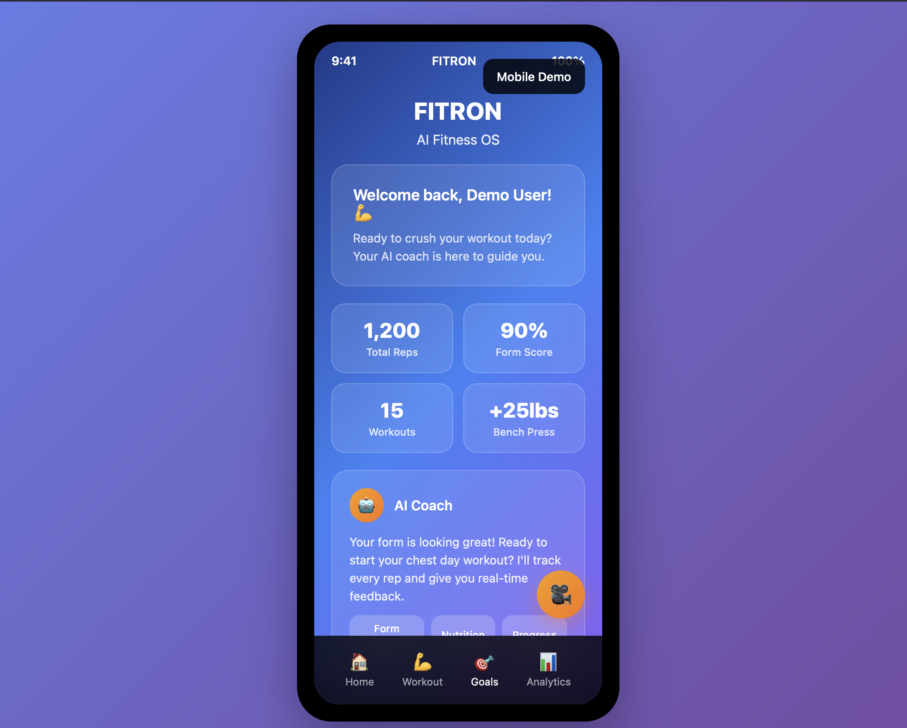

<p align="center">
<<<<<<< HEAD
  
=======
  
>>>>>>> 346a116545778bac4c83ebaf871e35c1a1605716
</p>

# 🏋️‍♂️ **FITRON — The AI Fitness OS**

**Train Smart. Train Safe. Build Your Dream Physique.**

---


---

## 💡 **What is FITRON?**

<<<<<<< HEAD
**FITRON** isn't another generic fitness app —  
it's your personal **AI-powered fitness OS**, designed to train, protect, and transform you like a world-class coach would — but smarter, faster, and always available.

- ✅ Tracks **every rep** with real-time pose estimation and correction
- ✅ Detects **unsafe lifting & ego-lifting** — locks dangerous sets to protect you
- ✅ Maps your goals to **celebrity-level physiques** using advanced CLIP embeddings
- ✅ Generates daily adaptive plans powered by **ZenML pipelines**
- ✅ Fine-tunes workouts and diet recommendations using real performance data
- ✅ Lets you **escalate to real, certified trainers** when you want human oversight
- ✅ Provides an **interactive AI Coach** that talks back, plans, corrects, and adapts
=======
**FITRON** isn’t another generic fitness app —  
it’s your personal **AI-powered fitness OS**, designed to train, protect, and transform you like a world-class coach would — but smarter, faster, and always available.

- Tracks **every rep** with real-time pose estimation and correction
- Detects **unsafe lifting & ego-lifting** — locks dangerous sets to protect you
- Maps your goals to **celebrity-level physiques** using advanced CLIP embeddings
- Generates daily adaptive plans powered by **ZenML pipelines**
- Fine-tunes workouts and diet recommendations using real performance data
- Lets you **escalate to real, certified trainers** when you want human oversight
- Provides an **interactive AI Coach** that talks back, plans, corrects, and adapts
>>>>>>> 346a116545778bac4c83ebaf871e35c1a1605716

No more guesswork. No more bad form. No more gym anxiety.  
FITRON is your **coach, physio, nutritionist, and trainer — all in one AI OS.**

---

## ⚡️ **Why FITRON is 10X Smarter**

❌ **Other Fitness Apps:**  
- Just show static workouts or generic plans  
- Zero posture or safety checks  
- No personalized goal physique mapping  
- No real trainer to fix mistakes in real-time  
- Limited or no adaptive daily logic

✅ **FITRON:**  
- Tracks **every single rep** in real-time using OpenCV + YOLO + Mediapipe  
- Analyzes form, highlights unsafe technique, and prevents ego lifting  
<<<<<<< HEAD
- **Maps dream physiques** — *"Want Salman Khan's shoulders?"* FITRON shows you exactly how to build them  
=======
- **Maps dream physiques** — *“Want Salman Khan’s shoulders?”* FITRON shows you exactly how to build them  
>>>>>>> 346a116545778bac4c83ebaf871e35c1a1605716
- Uses **ZenML + MLflow** to auto-update your training & diet daily  
- Offers **human trainer escalation** for Pro users — real people watch your form, chat with you, and keep you on track  
- Next-gen **Trainer Dashboard** for live monitoring & feedback  
- Seamlessly combines **AI + CV + LLM + Real Trainers** in one OS  
- Designed for absolute beginners **and** elite athletes

---

## 🎥 **Demo & Showcase**

<p align="center">
  
</p>

---

<<<<<<< HEAD
## 🔮 **What's Next — The FITRON Roadmap**

🚀 **Phase 1:** Core pose estimation, form correction, AI Coach, and Trainer Dashboard  
🧩 **Phase 2:**  
=======
## 🔮 **What’s Next — The FITRON Roadmap**

- Core pose estimation, form correction, AI Coach, and Trainer Dashboard   
>>>>>>> 346a116545778bac4c83ebaf871e35c1a1605716
- AR overlays for real-time pose feedback  
- Biometric wearables integration (Apple Watch, Fitbit)  
- RAG-powered coaching memory for smart follow-ups  
- Human trainer marketplace for instant expert support  
<<<<<<< HEAD
🎮 **Phase 3:**  
=======
>>>>>>> 346a116545778bac4c83ebaf871e35c1a1605716
- Community hub: leaderboards, daily streaks, group challenges  
- Body transformation competitions with AI scoring  
- Plug & play APIs for gyms, PTs, and physiotherapists

---

## 👑 **Why We Built FITRON**

> *"We built FITRON to make sure no beginner ever feels lost in a gym again. To give every athlete, lifter, or casual gym-goer the same elite-level coaching, form correction, and safety net only pro athletes get — powered by AI, secured by real human oversight."*

---

<<<<<<< HEAD
## 🗂️ **Folder Structure**

```
fitron/
├── backend/ (FastAPI, OpenCV, CLIP, ZenML)
├── mobile/ (Flutter App: UI, Camera, Widgets)
├── trainer_dashboard/ (React + Tailwind)
├── data/ (Videos, Logs, Embeddings)
├── notebooks/ (Pose Prototype, Physique Mapping)
├── deployment/ (Docker, NGINX, Prometheus)
├── assets/ (Images for README & Demos)
```

---

## 📬 **Contact**

👨‍💻 **Lead Dev:**  > Priyanshu Mishra


=======

## 📬 **Contact**

👨‍💻 **Lead Dev:**
> Priyanshu Mishra
---
>>>>>>> 346a116545778bac4c83ebaf871e35c1a1605716
